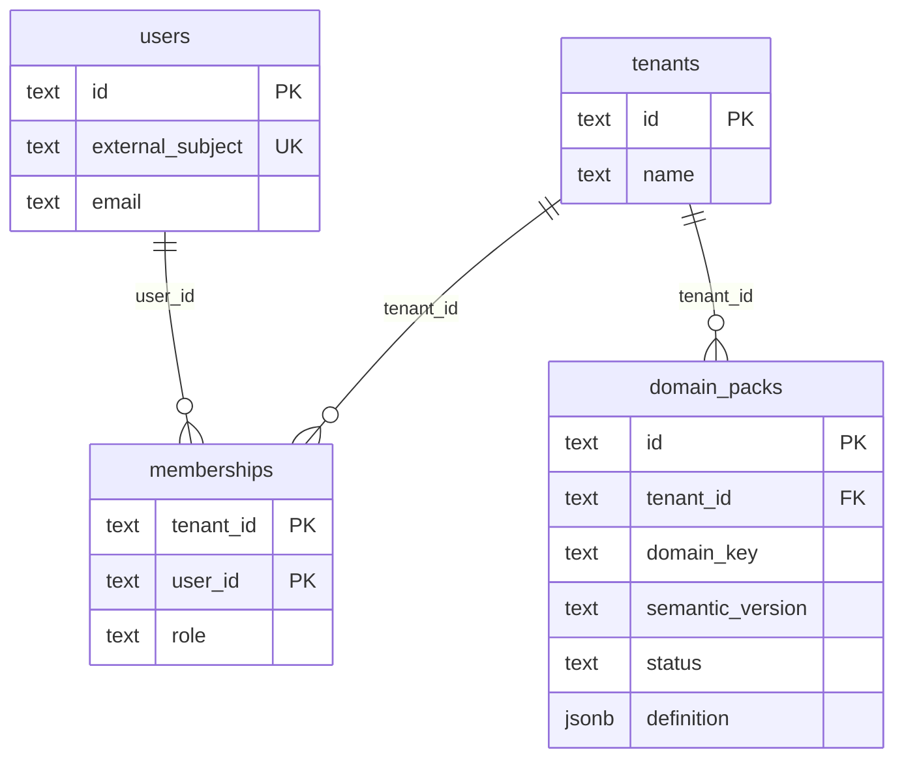
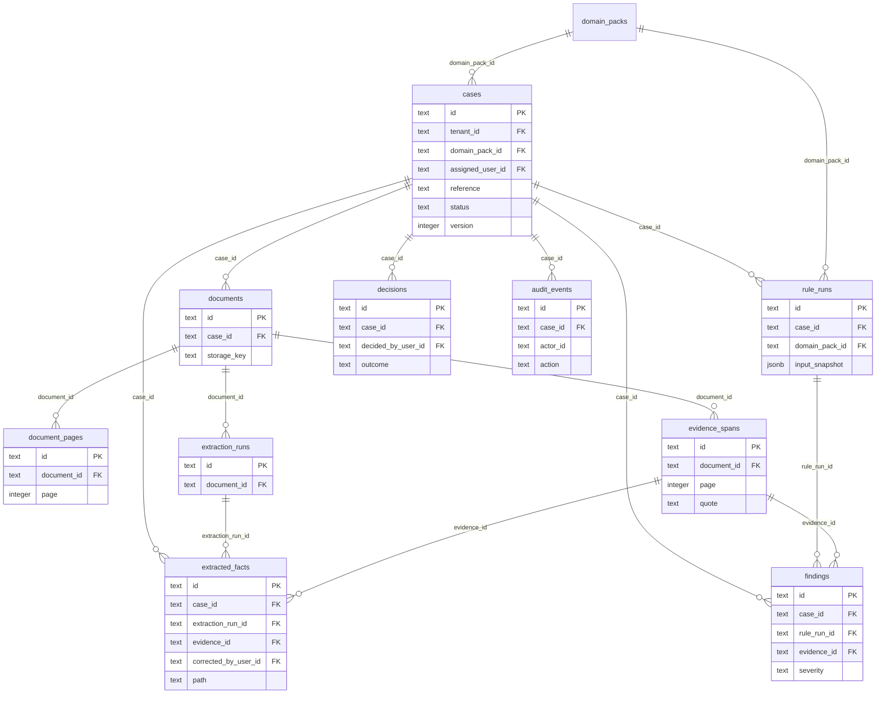
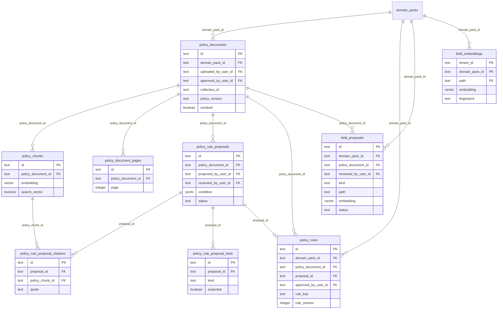
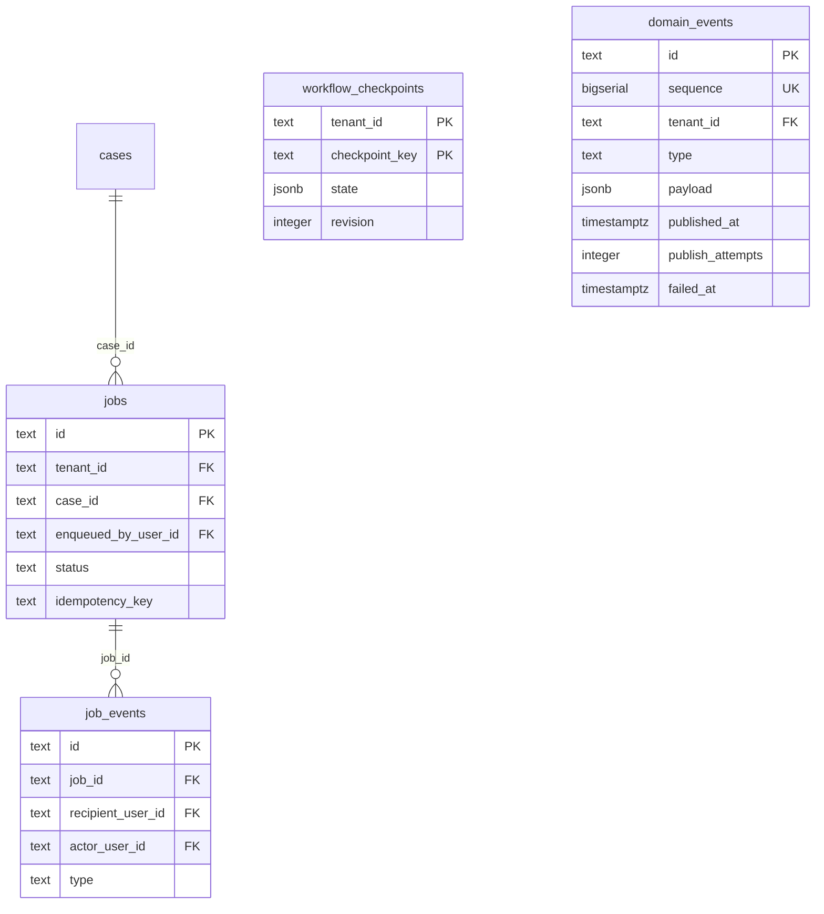

# CaseLens Architecture

CaseLens is a domain-neutral document intelligence and compliance-review platform. The included pharmacy supplier workflow is a reference domain, not a hard-coded product boundary.

## System shape

```text
Next.js review console
        |
        v
NestJS application API <---- read-only MCP server
        |
        +---- case and document services
        +---- policy upload, proposal review, and activation
        +---- durable actor-scoped job/event feed
        +---- versioned domain packs and deterministic rules
        +---- provider registry and typed ports
        |
        v
NestJS workflow worker
        |
        +---- validation and malware scan gate
        +---- native text extraction / OCR fallback
        +---- schema-constrained fact extraction
        +---- reconciliation and conflict detection
        +---- scoped policy retrieval
        +---- deterministic evaluation
        +---- human-review checkpoint

NestJS application API
        |
        +---- (same transaction) ----> domain_events outbox in PostgreSQL
                                              |
                                        relay in apps/worker
                                              |
                                              v
                                RabbitMQ topic exchange caselens.events
                                              |
                                              v
                                     queue analytics.events
                                              |
                                              v
                                      apps/analytics ----> its OWN database
                                              | (unprocessable)
                                              v
                                     analytics.events.dlq
```

The browser never talks directly to PostgreSQL, Redis, MinIO, or Ollama. Next.js forwards the selected local test identity to NestJS; NestJS authorizes every case, policy, source-file, and job request. Source bytes are streamed only after authorization.

## Durable processing boundaries

Case and policy uploads follow the same delivery rule: write durable business state and a PostgreSQL job record before placing the small work reference in BullMQ. Redis coordinates claims, locks, retries, and backoff; it is not the job-history database. The worker appends progress to `job_events`, and the header feed filters those rows to the exact enqueueing user. Only the platform administrator receives an aggregate view.

Policy processing is a separate worker route: immutable PDF → page extraction/OCR → clause chunks → embeddings → pgvector → cited rule proposals. Proposals cannot execute until an administrator reviews their original clause, validation result, and four deterministic fixture classes. Activation writes immutable `policy_rules`; future case runs load the active rules for the tenant/domain/date and pin their identifiers and versions in `rule_runs.input_snapshot`.

Case review is evidence-first. The original PDF is the primary surface. Facts and findings carry a document, page, and quotation; selecting one creates a deep link and navigates to the matching source/page/highlight. Extracted text is explicitly labelled as a secondary aid.

Production adapters are defined for PostgreSQL/pgvector, Redis/BullMQ, S3-compatible storage, HTTP OCR, and configurable model APIs. Demo mode binds deterministic in-memory adapters so the complete review experience runs without credentials.

The production-local worker consumes BullMQ jobs and runs the LangGraph state machine with PostgreSQL checkpoints, MinIO sources, PyMuPDF/Tesseract extraction, Ollama models, and pgvector retrieval. Demo mode retains the deterministic progress simulator; see [`docs/architecture/langgraph-workflow.md`](docs/architecture/langgraph-workflow.md).

The production-local Compose profile also runs idempotent forward migrations after PostgreSQL provisioning and before API/worker startup, so an existing Docker volume receives job-event and policy-governance schema additions without being deleted.

## Event backbone

BullMQ carries **commands** — "process this case" — addressed to one known consumer. Nothing in the
system carried **facts** — "this case was decided" — that an unrelated service could react to without
being wired into the request path. The event backbone adds that second channel; it does not replace
the first.

### The outbox is the log, RabbitMQ is the delivery

Publishing to a broker inside a request handler is the dual-write problem: the database commit and
the publish are two systems, and a crash between them either loses a fact or announces one that was
rolled back. So `apps/api` appends the event to `domain_events` **inside the transaction that made
the business change**. There is no second system to fail halfway, and no request ever touches the
broker.

RabbitMQ is a broker, not a log — an acknowledged message is gone. A read model needs replay, so
`domain_events` is append-only and stays the history; RabbitMQ only moves messages to live
consumers. Rebuilding a projection reads the table, not the queue.

Three event types are defined in [`packages/events`](packages/events), shared by publisher and
consumer so the wire format has one definition: `case.created`, `case.decided`, `finding.raised`.
Each envelope carries `id` (the consumer's idempotency key), `type` (also the routing key),
`tenantId`, `aggregateType`/`aggregateId`, `occurredAt`, `sequence`, and a typed `payload`.

### The relay claims rather than reads

[`apps/worker/src/events/relay.ts`](apps/worker/src/events/relay.ts) polls the outbox, publishes on
a **confirm channel**, and stamps `published_at` only after the broker confirms. Delivery is
at-least-once by construction: a crash between the confirm and the stamp republishes on the next
pass. Consumers must dedupe on event id; exactly-once is not offered.

Two details are what make more than one relay instance safe, and both were bugs in the first cut:

- **`FOR UPDATE SKIP LOCKED`.** A plain `SELECT` gives two relays the same rows and every event goes
  out twice. The read is a claim: `LIMIT` sits above `LockRows` in the plan, so a second relay walks
  past the rows the first holds — refused row by row, never waiting — and accumulates its own batch
  from what is left. The lock lives only inside the transaction, which is why publishing happens
  inside `claimUnpublishedEvents` rather than after a read returns.
- **`publish_attempts` and `failed_at`.** An event that can never be published — a publisher bug, a
  type the relay's `packages/events` version does not know — used to be skipped without being
  counted, so it reappeared in every batch forever. Enough of them fill the batch and real events
  starve while the relay still reports itself healthy. Attempts are now counted, and after five the
  row is quarantined out of the delivery index. Nothing is deleted: the payload and its place in the
  sequence survive for replay and for a human to read `last_error`.

A broker refusal stops the batch instead of skipping ahead, so consumers never see event 5 before
event 4. A parse failure does not stop it — that event can never be delivered, and holding the
backlog behind it would trade one stuck event for all of them.

### Current status

`apps/analytics` is the first consumer, and the first service in this system that learns about the
business from events rather than from the database. It shares no schema, no repository and no
workspace package with the case pipeline - only the wire format in `packages/events` - so it can be
deployed, broken or rebuilt without the pipeline noticing, and `apps/api` does not know it exists.

It has its own PostgreSQL server - not another database on the existing one, which would make
"analytics is down" and "the case pipeline is down" the same outage. Its schema is hand-written SQL
migrated separately; it deliberately does not import `packages/persistence`, because a compile-time
dependency on a schema it must never read would last exactly until someone found a join convenient.

**Idempotency is one transaction.** Delivery is at-least-once and always will be, so the consumer
records the event id and updates the projection together or not at all. Recording first and
projecting after is the dual-write problem rebuilt on the consuming side: a crash between them marks
an event processed that never was, and because the id is already recorded no redelivery can ever
repair it. `insert ... on conflict do nothing` makes the insert itself the claim - if it changed no
row, another delivery already won.

**Deliveries are settled one at a time.** `prefetch` bounds what the broker may push, not what the
consumer may work on: handling deliveries concurrently let a `case.decided` transaction open 2.5ms
after its `case.created` and before that one committed, so under READ COMMITTED it saw no case
dimension and attributed a real decision to an unknown domain pack. Chaining the handler keeps
prefetch's benefit - the next message is already in memory rather than a round trip away - without
the concurrency that breaks causal order. Note that this only holds because one relay publishes in
sequence order on one channel; the projection still has to tolerate arriving out of order, which is
what replay ultimately repairs.

Three details in its topology are equally deliberate:

- **One binding per event type it handles**, never `#`. A binding is a consumer declaring its
  interest; a wildcard hands that decision back to the publisher, so a new event type added to the
  contract would start arriving before anyone decided what to do with it.
- **Acknowledge after processing, never on receipt.** The broker forgets an acknowledged message, so
  acking first would turn a crash mid-projection into a lost fact.
- **`x-dead-letter-exchange` declared up front**, before any retry logic uses it. Queue arguments are
  immutable in RabbitMQ: redeclaring a queue with different arguments is refused with
  PRECONDITION_FAILED, so adding the argument later is a destructive migration rather than a
  configuration change.

It projects `case_throughput_daily` (intake and decisions per tenant, day and domain pack) and
`case_cycle_time` (one row per decided case, so the read API computes real percentiles instead of an
average that hides the tail). `case_dimensions` is reference data the service accumulates for
itself: `case.decided` deliberately does not carry the domain pack, because a payload should carry
what a consumer needs to interpret the fact rather than a copy of a row, so the projection remembers
what `case.created` told it instead of calling back into the case service.

`projection_state.last_sequence` is the consumer half of the lag measurement: compared against
`max(sequence)` in the outbox it turns eventual consistency into a number rather than a word.

Still to come, in [`docs/superpowers/plans/2026-09-06-event-backbone.md`](docs/superpowers/plans/2026-09-06-event-backbone.md):
the counters themselves and a read API, `finding.raised` (declared in the contract but not yet
emitted), retry-before-dead-letter, replay from the outbox, and lag surfaced in the console.

## Design boundaries

- `apps/web` contains presentation and interaction logic; the API remains authoritative.
- `apps/api` exposes tenant-scoped application operations and audit-safe mutations.
- `apps/worker` owns long-running document and workflow execution.
- `apps/mcp` provides a read-only agent interface over the application API.
- `packages/domain` contains versioned domain packs and an allowlisted rule DSL.
- `packages/providers` isolates model, OCR, storage, retrieval, queue, scanner, and persistence vendors behind typed ports.
- `packages/document-pipeline` preserves document, page, extraction, confidence, and evidence provenance.
- `packages/retrieval` enforces tenant, domain, pack-version, validity, and revocation scope before ranking evidence.
- `packages/workflow` owns resumable orchestration and human-review pauses.
- `apps/analytics` consumes domain facts into its own read model and shares no table with any other service.
- `packages/events` defines the domain-event envelope and payload schemas shared by publisher and consumer.
- `packages/persistence` defines the PostgreSQL/pgvector schema, indexes, and tenant RLS policies.

## Provider interchangeability

Application and domain code depend on capabilities rather than SDK-specific types. Providers are selected through validated configuration and a capability-aware registry. Replacing a model or infrastructure service therefore requires an adapter plus configuration, not changes to business rules or the review UI.

## Domain interchangeability

A domain pack versions its document taxonomy, extraction schemas, thresholds, policy metadata, rules, decision mapping, and reviewer checklist. New legal, insurance, or manufacturing workflows can be introduced as new packs while sharing ingestion, evidence, workflow, audit, and provider infrastructure.

## Database schema

The canonical definition is [`packages/persistence/src/schema.ts`](packages/persistence/src/schema.ts) — 26 Drizzle tables. This section maps it; it is not a second source of truth. When the two disagree, the schema file is right.

Two rules hold across every diagram below, so they are stated once rather than drawn two dozen times:

- **Every business table carries `tenant_id` referencing `tenants.id`**, and PostgreSQL row-level security scopes reads and writes to the caller's tenants. Those edges are omitted from the diagrams; assume them everywhere.
- **Every table carries the shared audit columns** (`created_at`, `updated_at`, and where applicable `version` for optimistic concurrency). `audit_events.actor_id` is deliberately plain text rather than a foreign key, because an actor may be the worker or the system rather than a user.

### Identity and configuration

`domain_packs` is the versioned per-tenant pack: `definition` holds the whole `DomainPack` as JSONB, and approving a proposed field or a new collection mints a new row rather than mutating one.



`memberships` has a composite primary key of `(tenant_id, user_id)`, both of which are also foreign keys. `domain_packs` is unique on `(tenant_id, domain_key, semantic_version)`, which is what lets one lineage hold many versions with a single active row.

### Case pipeline

This is the provenance chain the safety model depends on: a finding points at the rule run that produced it and the evidence span that justifies it, and that span points at a document and page.



`rule_runs.input_snapshot` pins the rule identifiers and versions a case was judged against, so a later pack version never rewrites the history of a decision already taken.

### Policy governance and the field dictionary

An uploaded policy is immutable. Everything derived from it — clause chunks, proposed rules, proposed fields — is a separate row that an administrator must approve before it can affect a case.



`field_proposals` and `field_embeddings` are deliberately separate tables. The first is the governance record of what a policy proposed and how it was reviewed. The second is the search index over the vocabulary the active pack actually holds, including fields that came from the compiled pack and were never proposed. Deduplication recalls from the index, never from the record — recalling from the record would leave a fresh tenant with an empty corpus, so every candidate would read as distinct and duplicates would be minted freely.

### Operations



`domain_events` is the transactional outbox and has no foreign key to `cases` on purpose: it is an
append-only log of facts, and a fact must stay readable after the aggregate it describes changes
shape. `aggregate_id` is a plain reference, not a constraint. `sequence` is unique and monotonic so
a replay is ordered; `published_at` belongs to the relay alone; `publish_attempts`/`failed_at`
quarantine a row that can never be delivered. The grants deliberately omit `DELETE`.

`jobs` and `job_events` are the durable job history; Redis coordinates claims, locks and retries but is not the record. `job_events.recipient_user_id` is what scopes the notification feed to the person who enqueued the work. `workflow_checkpoints` has a composite key of `(tenant_id, checkpoint_key)`, so identical keys in different tenants cannot collide.

### Every table at a glance

| Table                            | Primary key                       | Foreign keys (besides `tenant_id`)                                           |
| -------------------------------- | --------------------------------- | ---------------------------------------------------------------------------- |
| `tenants`                        | `id`                              | —                                                                            |
| `users`                          | `id`                              | —                                                                            |
| `memberships`                    | `tenant_id, user_id`              | `user_id`                                                                    |
| `domain_packs`                   | `id`                              | —                                                                            |
| `cases`                          | `id`                              | `domain_pack_id`, `assigned_user_id`                                         |
| `documents`                      | `id`                              | `case_id`                                                                    |
| `document_pages`                 | `id`                              | `document_id`                                                                |
| `extraction_runs`                | `id`                              | `document_id`                                                                |
| `evidence_spans`                 | `id`                              | `document_id`                                                                |
| `extracted_facts`                | `id`                              | `case_id`, `extraction_run_id`, `evidence_id`, `corrected_by_user_id`        |
| `policy_documents`               | `id`                              | `domain_pack_id`, `uploaded_by_user_id`, `approved_by_user_id`               |
| `policy_chunks`                  | `id`                              | `policy_document_id`                                                         |
| `policy_document_pages`          | `id`                              | `policy_document_id`                                                         |
| `policy_rule_proposals`          | `id`                              | `policy_document_id`, `proposed_by_user_id`, `reviewed_by_user_id`           |
| `policy_rule_proposal_citations` | `id`                              | `proposal_id`, `policy_chunk_id`                                             |
| `policy_rule_proposal_tests`     | `id`                              | `proposal_id`                                                                |
| `policy_rules`                   | `id`                              | `domain_pack_id`, `policy_document_id`, `proposal_id`, `approved_by_user_id` |
| `rule_runs`                      | `id`                              | `case_id`, `domain_pack_id`                                                  |
| `findings`                       | `id`                              | `case_id`, `rule_run_id`, `evidence_id`                                      |
| `decisions`                      | `id`                              | `case_id`, `decided_by_user_id`                                              |
| `jobs`                           | `id`                              | `case_id`, `enqueued_by_user_id`                                             |
| `job_events`                     | `id`                              | `job_id`, `recipient_user_id`, `actor_user_id`                               |
| `audit_events`                   | `id`                              | `case_id`                                                                    |
| `domain_events`                  | `id`                              | — (`aggregate_id` is an unconstrained reference)                             |
| `workflow_checkpoints`           | `tenant_id, checkpoint_key`       | —                                                                            |
| `field_proposals`                | `id`                              | `domain_pack_id`, `policy_document_id`, `reviewed_by_user_id`                |
| `field_embeddings`               | `tenant_id, domain_pack_id, path` | `domain_pack_id`                                                             |

Migrations live in [`packages/persistence/migrations/`](packages/persistence/migrations/). The numbered files carry every change since the initial schema and are applied after [`infra/postgres/init`](infra/postgres/init) provisions a fresh database — the production-local compose profile and CI both apply them in that order.

## Safety model

- Uploaded bytes are validated by signature, MIME, size, page count, encryption state, and scanner result before processing.
- Document text is always treated as untrusted data; it cannot introduce executable rules or tool instructions.
- Material facts and findings retain source evidence references.
- Long documents are extracted in bounded page-aware chunks, and model-produced citations are accepted only when their normalized quote is present on the claimed page.
- Structured model responses are validated against application-owned schemas before entering workflow state.
- Deterministic rules own thresholds and approval gates; model output remains advisory.
- Tenant scope is enforced in contracts, retrieval filters, repository design, and PostgreSQL RLS.
- Corrections and decisions use optimistic concurrency and append audit events.

## Runtime profiles

The repository has two deliberately separate application profiles:

- `infra/docker-compose.demo.yml` starts only the API and web application with deterministic, process-local memory providers. It is the implemented portfolio runtime and requires no infrastructure credentials.
- `infra/docker-compose.production-local.yml` starts the complete local production topology: web, API, worker, PostgreSQL/pgvector, Redis/BullMQ, MinIO, Ollama/model provisioning, and the OCR service.

The PostgreSQL bootstrap creates `caselens_runtime` as a `NOLOGIN` least-privilege group role. A one-shot local provisioner creates `caselens_app`, sets its ignored environment-file password, and grants only that group role.

`APP_MODE=production` requires durable providers and normally verified OIDC. The local topology is the explicit exception: `AUTH_MODE=test-profiles` is accepted only with `ENABLE_TEST_IDENTITY_SWITCHER=true`. That switch must never be used for a public deployment.

For deeper detail, see:

- [`docs/specs/caselens.md`](docs/specs/caselens.md) — product and architecture specification
- [`docs/architecture/domain-pack-authoring.md`](docs/architecture/domain-pack-authoring.md) — adding or changing business domains
- [`docs/operations/provider-switching.md`](docs/operations/provider-switching.md) — changing AI and infrastructure providers
- [`docs/operations/security-and-privacy.md`](docs/operations/security-and-privacy.md) — threat assumptions and operational safeguards
- [`docs/superpowers/plans/2026-08-26-caselens.md`](docs/superpowers/plans/2026-08-26-caselens.md) — implementation record and remaining production backlog
