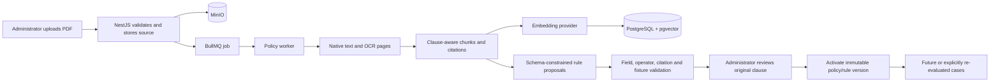
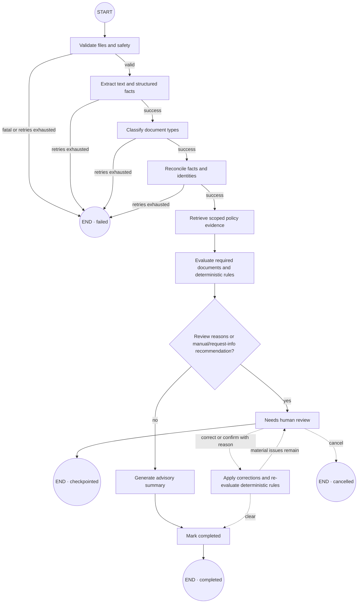

# CaseLens

CaseLens is a domain-neutral document-intelligence and compliance-review application. It turns a business dossier into traceable facts, evidence-backed findings, and a human-reviewed decision. The included example evaluates a pharmaceutical supplier; domain packs let the same engine support legal, insurance, or manufacturing workflows.

## Run the deterministic demo

Requirements: Docker Desktop with Linux containers.

```bash
docker compose -f infra/docker-compose.demo.yml up --build -d
```

Open the app at <http://localhost:3000> and API documentation at <http://localhost:4100/docs>.

```bash
docker compose -f infra/docker-compose.demo.yml ps
docker compose -f infra/docker-compose.demo.yml down
```

The demo starts only the web and API containers. It uses memory persistence, queue, storage, and search plus deterministic model, OCR, and scanner providers. It requires no cloud credentials and does not start unused infrastructure.

## Run the local production stack

This profile runs the complete application with durable storage, a real queue, local AI, and local OCR:

```powershell
Copy-Item infra/.env.production-local.example infra/.env.production-local
docker compose --env-file infra/.env.production-local -f infra/docker-compose.production-local.yml up --build -d
```

- App: <http://localhost:3000>
- API docs: <http://localhost:4100/docs>
- MinIO console: <http://localhost:9001>. With the supplied example environment, sign in as `caselens-admin` with password `local_minio_7Jq3V8rM2xK5`. If you edit the environment file, use its `MINIO_ROOT_USER` and `MINIO_ROOT_PASSWORD` instead.
- MinIO S3 API: <http://localhost:9000>

The first start downloads the Ollama runtime plus `qwen3:4b` and `embeddinggemma:300m-qat-q4_0`, so it can take several minutes and use roughly 3 GB. Follow progress with:

```powershell
docker compose --env-file infra/.env.production-local -f infra/docker-compose.production-local.yml ps
docker compose --env-file infra/.env.production-local -f infra/docker-compose.production-local.yml logs -f ollama-models api worker
```

For the CPU-local default, the worker processes one case and one model request at a time, with a five-minute request limit. This is deliberate: it is slower but avoids competing requests causing local-model timeouts. Deployments with dedicated model capacity can raise `WORKER_JOB_CONCURRENCY` and `WORKER_MODEL_CONCURRENCY` in the environment file.

Select a fictional identity from the profile menu. Lena, Jonas, Amara, and Mateo each administer one tenant in a different business domain. Mara Stein is the platform administrator and sees the cross-tenant queue. This is intentionally a local test impersonation mechanism, not authentication.

Stop the stack without losing data using `docker compose ... down`. To intentionally erase all local CaseLens data and downloaded models, use the same command with `down --volumes`.

### Seed the expanded multi-tenant fixture pack

The production-local stack includes seven pharmacy documents and four documents each for the legal, insurance, and manufacturing tenants. The companion evidence and the three policy PDFs are synthetic, repeatable fixtures:

```powershell
npm run fixtures:generate:multi-tenant
npm run fixtures:seed:multi-tenant
```

Generation is byte-stable, and `npm run fixtures:verify` checks both fixture corpora: recorded hashes, page counts, required phrases, evidence-page anchors, Poppler renders, and two consecutive generations producing identical SHA-256 values.

The seed command uses the public API: it uploads each policy, extracts and indexes its clauses, approves the already-valid synthetic proposal, activates the policy, then queues the matching tenant case. The local-only `FIXTURE_POLICY_CATALOG_ENABLED=true` setting makes the three marked policy proposals deterministic; it does not bypass PDF extraction, MinIO, pgvector embeddings, BullMQ, review/activation, or case processing. Keep this flag disabled outside the local synthetic demo.

## Components and why they exist

| Component                    | Purpose                                                                                            | Current runtime status                                                 |
| ---------------------------- | -------------------------------------------------------------------------------------------------- | ---------------------------------------------------------------------- |
| `apps/web`                   | Next.js review console for cases, documents, evidence, findings, corrections, and decisions        | Used by both demo and local production                                 |
| `apps/api`                   | Authoritative NestJS API enforcing validation, tenant scope, and business invariants               | Memory-backed in demo; PostgreSQL-backed in local production           |
| `apps/worker`                | Consumes BullMQ jobs and runs document processing plus LangGraph                                   | Deterministic simulator in demo; durable consumer in local production  |
| `apps/mcp`                   | Read-only agent interface over the API                                                             | Optional; not started by Compose                                       |
| `packages/contracts`         | Shared Zod schemas, identifiers, and API/domain types                                              | Used across applications                                               |
| `packages/config`            | Validates environment variables and provider selections                                            | Used at startup                                                        |
| `packages/domain`            | Versioned domain packs and safe deterministic rule DSL                                             | Used by the workflow and demo data                                     |
| `packages/providers`         | Vendor-neutral ports plus deterministic, HTTP, S3, pgvector, and BullMQ adapters                   | Selected by environment in both runtime profiles                       |
| `packages/document-pipeline` | File validation, extraction/OCR strategy, structured facts, confidence, and provenance             | Implemented and tested as a package                                    |
| `packages/retrieval`         | Tenant/version/date-scoped policy indexing and retrieval for grounded decisions                    | Uses canonical policy chunks in PostgreSQL/pgvector                    |
| `packages/workflow`          | LangGraph state machine, retries, checkpoints, review pause, and resume                            | Memory checkpoints in demo; PostgreSQL checkpoints in local production |
| `packages/persistence`       | PostgreSQL/pgvector schema, repositories, indexes, and tenant RLS                                  | Active in local production                                             |
| PostgreSQL + pgvector        | Durable records plus hybrid/vector policy search                                                   | Internal production network service                                    |
| Redis + BullMQ               | Queue handoff, claim coordination, deduplication keys, and retry scheduling between API and worker | Internal production network service; not a business-data store         |
| MinIO                        | Local S3-compatible immutable source-document storage                                              | Active in local production; demo uses memory storage                   |
| Ollama                       | Free local structured generation and embeddings                                                    | Qwen3 + EmbeddingGemma by default; model names are configurable        |
| OCR service                  | Native PDF text extraction and Tesseract fallback                                                  | PyMuPDF + Tesseract, internal production network service               |

MinIO is not a business dependency. It is the local S3-compatible implementation of the replaceable `ObjectStorageProvider`; AWS S3, Cloudflare R2, another S3-compatible service, the filesystem adapter, or a new Azure Blob adapter can replace it without changing domain rules.

### What Redis does here

Redis is the transport behind BullMQ in local production. After the API has stored a job record in PostgreSQL, it places a small message in Redis containing the database job ID, tenant ID, case ID, and idempotency key. BullMQ lets one worker claim that message, limits the worker to two concurrent cases, attempts each failed job execution up to three times in total with exponential backoff, and prevents the same job ID from being enqueued twice. Completed queue entries are retained only as a bounded operational history, and Redis persistence uses append-only files on a Docker volume so an API or worker restart does not silently empty the queue.

Redis is **not** the source of truth for case progress and is not used as a general cache. PostgreSQL stores cases, document metadata, durable job status/progress, audit events, workflow checkpoints, and pgvector policy chunks. MinIO stores the uploaded file bytes. Ollama runs generation and embeddings. If Redis is unavailable, new processing work cannot be handed to a worker, but already persisted cases and documents remain in PostgreSQL and MinIO.

## What is stored where

| Data                                                           | Durable owner         | Why                                                                                                |
| -------------------------------------------------------------- | --------------------- | -------------------------------------------------------------------------------------------------- |
| Users, tenants, memberships, cases, facts, findings, decisions | PostgreSQL            | Transactional business state, optimistic versions, tenant RLS, and reporting                       |
| Uploaded case and policy PDFs                                  | MinIO                 | Immutable binary storage with stable object keys and SHA-256 provenance                            |
| Extracted page text and evidence coordinates                   | PostgreSQL            | Searchable, reviewable provenance tied to document and page                                        |
| Policy chunks and embedding vectors                            | PostgreSQL + pgvector | Hybrid lexical/vector policy retrieval with tenant, domain, version, date, and revocation filters  |
| Approved deterministic policy rules and rule tests             | PostgreSQL            | Reviewed executable configuration with source citations and immutable history                      |
| Current job status and user-visible job events                 | PostgreSQL            | Notifications survive browser, API, worker, and Redis restarts                                     |
| Waiting/active/retry queue records                             | Redis through BullMQ  | Fast worker coordination, locks, retries, backoff, cancellation, and bounded operational retention |
| LangGraph checkpoints                                          | PostgreSQL            | A worker can resume a durable workflow after a restart                                             |
| Model weights                                                  | Ollama volume         | Free local chat and embedding models without sending documents to a cloud provider                 |

Redis never stores the source PDF as business data, and pgvector is not a second database. `vector(768)` columns and their HNSW indexes live inside the same PostgreSQL service as the policy metadata.

## Database schema map

The canonical TypeScript definition is [`packages/persistence/src/schema.ts`](packages/persistence/src/schema.ts). SQL bootstrap and forward migrations live under [`infra/postgres/init`](infra/postgres/init) and [`packages/persistence/migrations`](packages/persistence/migrations).

| Schema group             | Main tables                                                                                             | Responsibility                                                                                                  |
| ------------------------ | ------------------------------------------------------------------------------------------------------- | --------------------------------------------------------------------------------------------------------------- |
| Identity and tenancy     | `tenants`, `users`, `memberships`                                                                       | Fictional local identities now; tenant/user authorization boundary for every durable record                     |
| Domain configuration     | `domain_packs`                                                                                          | Immutable installed domain-pack versions, extraction fields, deterministic DSL, and thresholds                  |
| Case intake              | `cases`, `case_participants`, `documents`, `document_pages`                                             | Case state, original-object metadata, per-page extraction method/text/quality, and assignment                   |
| Evidence extraction      | `extraction_runs`, `evidence_spans`, `extracted_facts`                                                  | Model/prompt provenance, page quotations/coordinates, normalized facts, corrections, and confidence             |
| Policy library           | `policy_documents`, `policy_document_pages`, `policy_chunks`                                            | Immutable policy versions, source object metadata, extracted pages, searchable passages, and embeddings         |
| Policy governance        | `policy_rule_proposals`, `policy_rule_proposal_citations`, `policy_rule_proposal_tests`, `policy_rules` | AI proposals, exact source clauses, deterministic tests, review state, priority, activation, and revocation     |
| Evaluation and decisions | `rule_runs`, `findings`, `decisions`                                                                    | Pinned input/policy versions, deterministic results, reviewer resolution, and final human decision              |
| Async processing         | `jobs`, `job_events`, `workflow_checkpoints`                                                            | Current job snapshot, append-only per-user processing timeline, retry/cancel history, and workflow resume state |
| Audit                    | `audit_events`                                                                                          | Append-only business actions with actor, resource, tenant, correlation ID, and safe details                     |

Tenant-owned tables enable and force PostgreSQL row-level security. Application queries also enforce role, tenant, and—in the notification feed—the exact user who enqueued the job. The platform administrator is the explicit aggregate exception.

## What acts when a case is processed

| Step           | Active part                           | Action                                                                                    | Durable result                                                      |
| -------------- | ------------------------------------- | ----------------------------------------------------------------------------------------- | ------------------------------------------------------------------- |
| 1. Upload      | Web → API                             | Send one PDF with the selected profile and an idempotency key                             | MinIO object, `documents` row, audit event                          |
| 2. Queue       | API → PostgreSQL → BullMQ             | Create the durable job first, then place its small ID payload in Redis                    | `jobs` snapshot plus `job.created` and queue events                 |
| 3. Claim       | BullMQ → worker                       | One worker claims the job; concurrent processing is bounded                               | `worker.claimed`, attempt number, processing state                  |
| 4. Read        | Worker → MinIO → OCR service          | Load bytes, extract native text, and use Tesseract only for weak/scanned pages            | `document_pages`, extraction strategy, warnings                     |
| 5. Extract     | Worker → Ollama chat model            | Ask only for allowlisted domain fields; validate types and exact page quotes              | Evidence-linked fact candidates; invalid output becomes review work |
| 6. Reconcile   | LangGraph + domain package            | Normalize facts and expose identity/value conflicts without overwriting them              | Canonical facts, alternatives, review reasons                       |
| 7. Retrieve    | Worker → Ollama embeddings → pgvector | Embed the case query and rank only active in-scope policy passages                        | Cited policy chunks or an explicit retrieval abstention             |
| 8. Evaluate    | Deterministic rule engine             | Evaluate required documents and approved domain/policy rules                              | `rule_runs`, findings, pinned rule/policy versions                  |
| 9. Review gate | LangGraph                             | Pause when evidence is missing, conflicting, low-confidence, or policy retrieval abstains | PostgreSQL checkpoint and `needs_review` status                     |
| 10. Decide     | Reviewer/approver → API               | Correct facts, resolve findings, re-evaluate explicitly, and record a decision            | Versioned corrections, findings, decision, audit trail              |

The model extracts and summarizes; it does not approve. Threshold comparisons, required-document gates, rule tests, and final human decisions remain deterministic or human-owned.

## What acts when a policy is processed



Policy PDF text is untrusted evidence. It cannot insert JavaScript, change prompts, create unknown fact fields, or activate itself. A proposal must use the allowlisted rule DSL, cite an exact policy page/quote, pass match/no-match/missing-value/boundary tests, and receive administrator approval. Existing cases retain the versions used during their original evaluation until someone explicitly requests re-evaluation.

The review screen always shows every generated rule. A green test means the actual result matched its expected result; red means that exact expectation failed, regardless of whether the category is `match`, `no_match`, `missing_value`, or `boundary`. Validation blockers list their code, field path, and explanation. Valid rules may be approved or dismissed; invalid rules may be dismissed with an audit reason but cannot be approved. Selecting a citation navigates the original PDF to its page and highlights the matching clause.

## Original-document evidence review

The case workspace renders the authorised original PDF in the centre pane. “Extracted text” is a secondary review aid. Selecting a fact or finding updates a deep link containing `document`, `page`, and `evidence`, switches to the correct source, opens the page, and highlights matching text. The original is streamed through the API after tenant authorization; the browser never receives MinIO credentials. When exact geometry is unavailable, the UI labels and uses quote matching rather than pretending the highlight is exact.

For supplier follow-up, a reviewer marks one or more findings with **Add to follow-up**. **Request information** then opens a deterministic business-tone draft containing every selected finding and requested action. If the case documents expose a contact email, the primary action records the request and opens the operating system's email client through an encoded `mailto:` draft. Without an email, the complete subject and message remain visible and the primary action records and copies them for manual delivery. Draft generation is local and does not send case content to another model.

## Processing notifications and user isolation

The header notification centre reads the durable `jobs`/`job_events` feed. A tenant user sees only jobs whose `enqueued_by_user_id` matches the active profile—even another user in the same tenant cannot see them. Switching profiles closes the old event stream and clears its cached items before opening the new feed. Mara Stein, the platform administrator, may inspect the aggregate cross-tenant feed.

The UI distinguishes these events instead of calling all of them “deleted”:

```text
created → enqueue requested → queued → worker claimed → processing stages
        → completed / needs review / failed / cancelled
        → queue record removed by explicit retention or cancellation
```

Claiming a job means work started; it is not deletion. Removing a completed Redis record is operational cleanup and does not remove the PostgreSQL history. Important terminal events produce an in-app notification; the detailed ledger keeps stage, progress, attempts, safe errors, cancellation, retry, and cleanup history.

See [ARCHITECTURE.md](ARCHITECTURE.md) for system boundaries and [AGENTS.md](AGENTS.md) for contributor guidance.

## Current LangGraph process

This diagram mirrors the compiled graph in `packages/workflow/src/workflow.ts`:



Important behavior:

- Validate, extract, classify, reconcile, retrieve, and summarize use bounded retry and timeout handling.
- Extraction processes page-aware text in bounded, overlapping chunks so long dossiers do not overflow a model context window.
- The local Ollama adapter disables reasoning for extraction, requests JSON, and validates every response in the application against its Zod schema. Model output cannot change the schema or bypass validation.
- Policy proposal generation allows up to 300 seconds by default for CPU-only Ollama (`WORKER_POLICY_MODEL_TIMEOUT_MS` can be set from 30000 to 600000) and caps each response at three proposals.
- Every accepted fact citation must name the uploaded document, page, and an exact normalized quote present on that page; unsupported citations are rejected.
- Unknown fields, wrong value types, and unsupported model citations are quarantined as review warnings instead of crashing the whole case.
- Retrieval failure abstains and adds a review reason; it does not silently use an unrelated policy.
- Deterministic rules produce findings and the recommendation. The model-generated summary is advisory.
- Human corrections require a reason and create a new checkpoint revision before re-evaluation.
- `CaseWorkflowRunner` is used by the production worker. The deterministic demo keeps its simpler no-infrastructure progress runner.

See [LangGraph workflow](docs/architecture/langgraph-workflow.md) for every node, branch, state field, retry rule, and production wiring.

## Start for development

Requirements: Node.js 24+ and npm 11+.

```bash
npm install
npm run dev --workspace=@caselens/api
npm run dev --workspace=@caselens/web
```

Run the API and web commands in separate terminals. The worker can be run separately when developing its processor:

```bash
npm run dev --workspace=@caselens/worker
```

## Verify

```bash
npm run verify
python scripts/verify-fixtures.py
```

The database integration suites run automatically in CI. Against the local production stack, run the disposable test profile. It receives a runtime connection for RLS assertions and a local-only owner connection solely to remove its uniquely prefixed fixtures afterward; PostgreSQL remains private to Docker:

```powershell
docker compose --profile test --env-file infra/.env.production-local -f infra/docker-compose.production-local.yml run --rm integration-tests
```

With the demo running, install Chromium once and execute the browser suite:

```bash
npm exec -- playwright install chromium
npm run test:e2e
```

The suite runs desktop and mobile Chromium checks. `apps/web/e2e/notifications.spec.ts` guards the header bell, unread badge, open/close controls, keyboard dismissal, job timeline, clickability, and viewport overflow. `policy-review.spec.ts` covers rule visibility, validation/test semantics, citation highlighting, and blocked-rule dismissal; `case-workspace.spec.ts` covers the follow-up composer and case evidence navigation.

Playwright targets `http://127.0.0.1:3000` by default. Inspect the latest HTML report with:

```bash
npm exec -- playwright show-report playwright-report
```

A global Playwright installation is not required.
