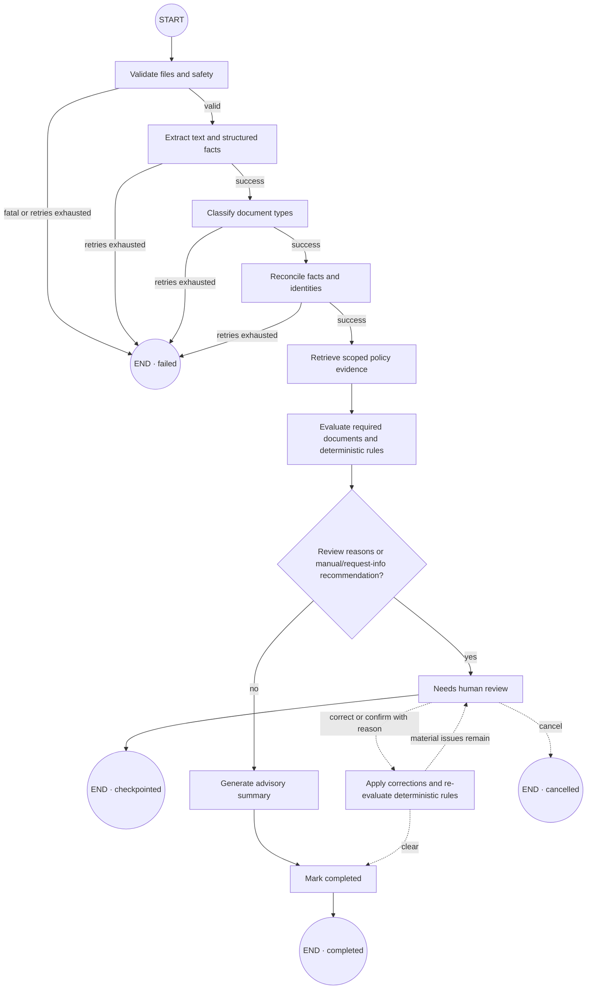

# CaseLens

CaseLens is a domain-neutral document-intelligence and compliance-review application. It turns a business dossier into traceable facts, evidence-backed findings, and a human-reviewed decision. The included example evaluates a pharmaceutical supplier; domain packs let the same engine support legal, insurance, or manufacturing workflows.

## Run the deterministic demo

Requirements: Docker Desktop with Linux containers.

```bash
docker compose -f infra/docker-compose.demo.yml up --build -d
```

Open the app at <http://localhost:3000> and API documentation at <http://localhost:4100/docs>.

```bash
docker compose -f infra/docker-compose.demo.yml ps
docker compose -f infra/docker-compose.demo.yml down
```

The demo starts only the web and API containers. It uses memory persistence, queue, storage, and search plus deterministic model, OCR, and scanner providers. It requires no cloud credentials and does not start unused infrastructure.

## Run the production-infrastructure stack

PostgreSQL/pgvector, Redis, and MinIO are isolated in a separate stack for durable-provider development:

```powershell
Copy-Item infra/.env.prod-infra.example infra/.env.prod-infra
# Replace every example secret in infra/.env.prod-infra.
docker compose --env-file infra/.env.prod-infra -f infra/docker-compose.prod-infra.yml up -d
```

- PostgreSQL: `localhost:5432` by default.
- Redis: `localhost:6379` by default.
- MinIO S3 API: <http://localhost:9000> by default.
- MinIO console: <http://localhost:9001> by default; credentials come from `infra/.env.prod-infra`.

This stack is infrastructure preparation, not a deployable production CaseLens application. API/worker production startup remains deliberately blocked until PostgreSQL repositories, durable LangGraph checkpoints, BullMQ consumption, S3 document storage, verified OIDC, and dependency-backed readiness checks are composed.

The database bootstrap creates a least-privilege `caselens_runtime` group role with `NOLOGIN`; a deployment must create its login identity and inject its password through a secret manager. No application database password is committed to the repository.

## Components and why they exist

| Component                    | Purpose                                                                                     | Current runtime status                                                             |
| ---------------------------- | ------------------------------------------------------------------------------------------- | ---------------------------------------------------------------------------------- |
| `apps/web`                   | Next.js review console for cases, documents, evidence, findings, corrections, and decisions | Used by the demo                                                                   |
| `apps/api`                   | Authoritative NestJS API enforcing validation and business invariants                       | Used by the demo with memory state                                                 |
| `apps/worker`                | Process boundary for slow OCR, model, retrieval, and workflow jobs                          | Processor scaffold exists; not connected to the demo API queue                     |
| `apps/mcp`                   | Read-only agent interface over the API                                                      | Optional; not started by Compose                                                   |
| `packages/contracts`         | Shared Zod schemas, identifiers, and API/domain types                                       | Used across applications                                                           |
| `packages/config`            | Validates environment variables and provider selections                                     | Used at startup                                                                    |
| `packages/domain`            | Versioned domain packs and safe deterministic rule DSL                                      | Used by the workflow and demo data                                                 |
| `packages/providers`         | Vendor-neutral ports plus deterministic, HTTP, S3, pgvector, and BullMQ adapters            | Deterministic adapters are active; durable adapters are available but not composed |
| `packages/document-pipeline` | File validation, extraction/OCR strategy, structured facts, confidence, and provenance      | Implemented and tested as a package                                                |
| `packages/retrieval`         | Tenant/version/date-scoped policy retrieval for grounded decisions                          | Implemented and tested as a package                                                |
| `packages/workflow`          | LangGraph state machine, retries, checkpoints, review pause, and resume                     | Implemented and tested; not yet wired into the demo worker                         |
| `packages/persistence`       | PostgreSQL/pgvector schema, migrations, indexes, and tenant RLS                             | Schema exists; repositories remain production backlog                              |
| PostgreSQL + pgvector        | Durable records plus hybrid/vector policy search                                            | Production-infrastructure stack only                                               |
| Redis + BullMQ               | Cross-process jobs, retries, cancellation, and progress                                     | Production-infrastructure stack only; consumer wiring remains backlog              |
| MinIO                        | Local S3-compatible storage for immutable source documents and derived artifacts            | Production-infrastructure stack only; demo uses memory storage                     |

MinIO is not a business dependency. It is the local S3-compatible implementation of the replaceable `ObjectStorageProvider`; AWS S3, Cloudflare R2, another S3-compatible service, the filesystem adapter, or a new Azure Blob adapter can replace it without changing domain rules.

See [ARCHITECTURE.md](ARCHITECTURE.md) for system boundaries and [AGENTS.md](AGENTS.md) for contributor guidance.

## Current LangGraph process

This diagram mirrors the compiled graph in `packages/workflow/src/workflow.ts`:



Important behavior:

- Validate, extract, classify, reconcile, retrieve, and summarize use bounded retry and timeout handling.
- Retrieval failure abstains and adds a review reason; it does not silently use an unrelated policy.
- Deterministic rules produce findings and the recommendation. The model-generated summary is advisory.
- Human corrections require a reason and create a new checkpoint revision before re-evaluation.
- `CaseWorkflowRunner` is real and covered by tests. The current demo worker still uses a simpler deterministic progress runner, so the diagram represents implemented workflow logic rather than today’s container-to-container execution path.

See [LangGraph workflow](docs/architecture/langgraph-workflow.md) for every node, branch, state field, retry rule, and the current wiring gap.

## Start for development

Requirements: Node.js 24+ and npm 11+.

```bash
npm install
npm run dev --workspace=@caselens/api
npm run dev --workspace=@caselens/web
```

Run the API and web commands in separate terminals. The worker can be run separately when developing its processor:

```bash
npm run dev --workspace=@caselens/worker
```

## Verify

```bash
npm run verify
python scripts/verify-fixtures.py
```

With the demo running, install Chromium once and execute the browser suite:

```bash
npm exec -- playwright install chromium
npm run test:e2e
```

Playwright targets `http://127.0.0.1:3000` by default. Inspect the latest HTML report with:

```bash
npm exec -- playwright show-report playwright-report
```

A global Playwright installation is not required.
