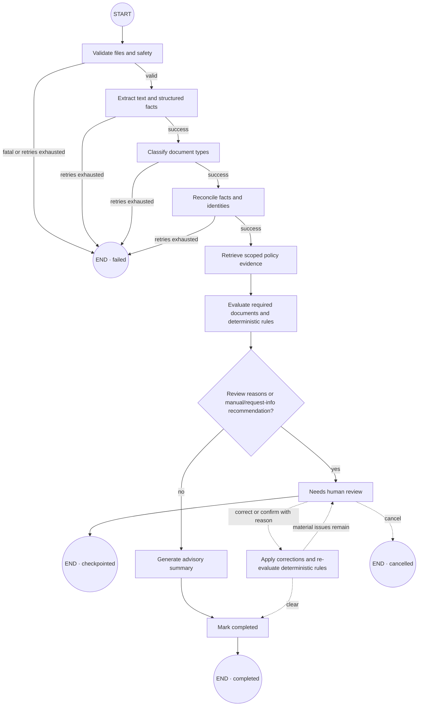

# CaseLens

CaseLens is a domain-neutral document-intelligence and compliance-review application. It turns a business dossier into traceable facts, evidence-backed findings, and a human-reviewed decision. The included example evaluates a pharmaceutical supplier; domain packs let the same engine support legal, insurance, or manufacturing workflows.

## Run the deterministic demo

Requirements: Docker Desktop with Linux containers.

```bash
docker compose -f infra/docker-compose.demo.yml up --build -d
```

Open the app at <http://localhost:3000> and API documentation at <http://localhost:4100/docs>.

```bash
docker compose -f infra/docker-compose.demo.yml ps
docker compose -f infra/docker-compose.demo.yml down
```

The demo starts only the web and API containers. It uses memory persistence, queue, storage, and search plus deterministic model, OCR, and scanner providers. It requires no cloud credentials and does not start unused infrastructure.

## Run the local production stack

This profile runs the complete application with durable storage, a real queue, local AI, and local OCR:

```powershell
Copy-Item infra/.env.production-local.example infra/.env.production-local
docker compose --env-file infra/.env.production-local -f infra/docker-compose.production-local.yml up --build -d
```

- App: <http://localhost:3000>
- API docs: <http://localhost:4100/docs>
- MinIO console: <http://localhost:9001>. With the supplied example environment, sign in as `caselens-admin` with password `local_minio_7Jq3V8rM2xK5`. If you edit the environment file, use its `MINIO_ROOT_USER` and `MINIO_ROOT_PASSWORD` instead.
- MinIO S3 API: <http://localhost:9000>

The first start downloads the Ollama runtime plus `qwen3:4b` and `embeddinggemma:300m-qat-q4_0`, so it can take several minutes and use roughly 3 GB. Follow progress with:

```powershell
docker compose --env-file infra/.env.production-local -f infra/docker-compose.production-local.yml ps
docker compose --env-file infra/.env.production-local -f infra/docker-compose.production-local.yml logs -f ollama-models api worker
```

Select a fictional identity from the profile menu. Lena, Jonas, Amara, and Mateo each administer one tenant in a different business domain. Mara Stein is the platform administrator and sees the cross-tenant queue. This is intentionally a local test impersonation mechanism, not authentication.

Stop the stack without losing data using `docker compose ... down`. To intentionally erase all local CaseLens data and downloaded models, use the same command with `down --volumes`.

## Components and why they exist

| Component                    | Purpose                                                                                     | Current runtime status                                                 |
| ---------------------------- | ------------------------------------------------------------------------------------------- | ---------------------------------------------------------------------- |
| `apps/web`                   | Next.js review console for cases, documents, evidence, findings, corrections, and decisions | Used by the demo                                                       |
| `apps/api`                   | Authoritative NestJS API enforcing validation and business invariants                       | Used by the demo with memory state                                     |
| `apps/worker`                | Consumes BullMQ jobs and runs document processing plus LangGraph                            | Deterministic simulator in demo; durable consumer in local production  |
| `apps/mcp`                   | Read-only agent interface over the API                                                      | Optional; not started by Compose                                       |
| `packages/contracts`         | Shared Zod schemas, identifiers, and API/domain types                                       | Used across applications                                               |
| `packages/config`            | Validates environment variables and provider selections                                     | Used at startup                                                        |
| `packages/domain`            | Versioned domain packs and safe deterministic rule DSL                                      | Used by the workflow and demo data                                     |
| `packages/providers`         | Vendor-neutral ports plus deterministic, HTTP, S3, pgvector, and BullMQ adapters            | Selected by environment in both runtime profiles                       |
| `packages/document-pipeline` | File validation, extraction/OCR strategy, structured facts, confidence, and provenance      | Implemented and tested as a package                                    |
| `packages/retrieval`         | Tenant/version/date-scoped policy retrieval for grounded decisions                          | Implemented and tested as a package                                    |
| `packages/workflow`          | LangGraph state machine, retries, checkpoints, review pause, and resume                     | Memory checkpoints in demo; PostgreSQL checkpoints in local production |
| `packages/persistence`       | PostgreSQL/pgvector schema, repositories, indexes, and tenant RLS                           | Active in local production                                             |
| PostgreSQL + pgvector        | Durable records plus hybrid/vector policy search                                            | Internal production network service                                    |
| Redis + BullMQ               | Cross-process jobs, retries, cancellation, and progress                                     | Internal production network service                                    |
| MinIO                        | Local S3-compatible immutable source-document storage                                       | Active in local production; demo uses memory storage                   |
| Ollama                       | Free local structured generation and embeddings                                             | Qwen3 + EmbeddingGemma by default; model names are configurable        |
| OCR service                  | Native PDF text extraction and Tesseract fallback                                           | PyMuPDF + Tesseract, internal production network service               |

MinIO is not a business dependency. It is the local S3-compatible implementation of the replaceable `ObjectStorageProvider`; AWS S3, Cloudflare R2, another S3-compatible service, the filesystem adapter, or a new Azure Blob adapter can replace it without changing domain rules.

See [ARCHITECTURE.md](ARCHITECTURE.md) for system boundaries and [AGENTS.md](AGENTS.md) for contributor guidance.

## Current LangGraph process

This diagram mirrors the compiled graph in `packages/workflow/src/workflow.ts`:



Important behavior:

- Validate, extract, classify, reconcile, retrieve, and summarize use bounded retry and timeout handling.
- Extraction processes page-aware text in bounded, overlapping chunks so long dossiers do not overflow a model context window.
- The local Ollama adapter disables reasoning for extraction, requests JSON, and validates every response in the application against its Zod schema. Model output cannot change the schema or bypass validation.
- Every accepted fact citation must name the uploaded document, page, and an exact normalized quote present on that page; unsupported citations are rejected.
- Unknown fields, wrong value types, and unsupported model citations are quarantined as review warnings instead of crashing the whole case.
- Retrieval failure abstains and adds a review reason; it does not silently use an unrelated policy.
- Deterministic rules produce findings and the recommendation. The model-generated summary is advisory.
- Human corrections require a reason and create a new checkpoint revision before re-evaluation.
- `CaseWorkflowRunner` is used by the production worker. The deterministic demo keeps its simpler no-infrastructure progress runner.

See [LangGraph workflow](docs/architecture/langgraph-workflow.md) for every node, branch, state field, retry rule, and the current wiring gap.

## Start for development

Requirements: Node.js 24+ and npm 11+.

```bash
npm install
npm run dev --workspace=@caselens/api
npm run dev --workspace=@caselens/web
```

Run the API and web commands in separate terminals. The worker can be run separately when developing its processor:

```bash
npm run dev --workspace=@caselens/worker
```

## Verify

```bash
npm run verify
python scripts/verify-fixtures.py
```

The database integration suites run automatically in CI. Against the local production stack, run them inside the API container so PostgreSQL remains private to Docker:

```powershell
docker compose --env-file infra/.env.production-local -f infra/docker-compose.production-local.yml exec -T api sh -lc 'TEST_DATABASE_URL="$DATABASE_URL" npm run test:integration:database'
```

With the demo running, install Chromium once and execute the browser suite:

```bash
npm exec -- playwright install chromium
npm run test:e2e
```

Playwright targets `http://127.0.0.1:3000` by default. Inspect the latest HTML report with:

```bash
npm exec -- playwright show-report playwright-report
```

A global Playwright installation is not required.
