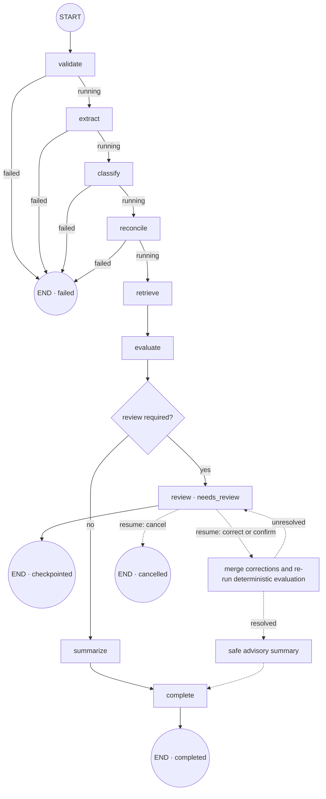

# LangGraph workflow

The implemented workflow lives in `packages/workflow/src/workflow.ts`. `CaseWorkflowRunner` compiles a LangGraph `StateGraph` over the state declared in `packages/workflow/src/state.ts`.

## Graph

The dashed human-resume path is implemented by `CaseWorkflowRunner.resume()` outside the compiled graph. It loads the saved checkpoint, requires a reviewer reason, applies fact corrections, re-runs required-document and deterministic domain rules, and saves the next optimistic revision.

## Node responsibilities

| Node        | Input/output responsibility                                                                                  | Failure behavior                                                                                                         |
| ----------- | ------------------------------------------------------------------------------------------------------------ | ------------------------------------------------------------------------------------------------------------------------ |
| `validate`  | Runs file/safety validation and appends warnings                                                             | Fatal validation results or exhausted retries set `status=failed` and end the graph                                      |
| `extract`   | Produces structured facts, low-confidence paths, and extraction warnings                                     | Exhausted retries set `status=failed` and end the graph                                                                  |
| `classify`  | Records available document types and ambiguity review reasons                                                | Exhausted retries set `status=failed` and end the graph                                                                  |
| `reconcile` | Detects cross-document identity conflicts and other reconciliation review reasons                            | Exhausted retries set `status=failed` and end the graph                                                                  |
| `retrieve`  | Retrieves tenant/domain/version/date-scoped policy citations                                                 | Missing/stale policy or provider failure becomes `retrievalStatus=abstained` plus a review reason; evaluation still runs |
| `evaluate`  | Runs required-document checks and the deterministic rule engine, sorts findings, and maps the recommendation | It does not call a model; material findings, conflicts, low confidence, and information gaps route to review             |
| `review`    | De-duplicates review reasons and sets `status=needs_review`                                                  | Ends the current run at a checkpoint awaiting a human command                                                            |
| `summarize` | Requests a non-authoritative human-readable summary                                                          | Provider failure produces a fixed fallback warning and does not change findings or recommendation                        |
| `complete`  | Sets `status=completed`                                                                                      | Ends the graph                                                                                                           |

## Retry and timeout policy

`validate`, `extract`, `classify`, `reconcile`, `retrieve`, and `summarize` run through the same bounded retry wrapper:

- default maximum attempts: `2`;
- default timeout per attempt: `30,000 ms`;
- attempt counts are retained in `state.attempts`;
- provider details are converted into safe workflow-level reasons;
- cancellation is checked before each node starts.

The graph deliberately treats retrieval differently from validation or extraction. A retrieval outage must not invent policy evidence, but it should preserve extracted facts and route the case to a reviewer instead of discarding the whole run.

## State carried between nodes

The graph state contains:

- scope and idempotency: `tenantId`, `caseId`, `idempotencyKey`;
- execution: `status`, `phase`, `attempts`, warnings;
- document results: facts, document types, and low-confidence paths;
- reconciliation: identity-conflict flag and review reasons;
- retrieval: status and citations;
- decision material: deterministic findings and recommendation;
- human/model output: review command and advisory summary.

## Idempotency and checkpoints

The checkpoint key is `tenantId:caseId:idempotencyKey`. A duplicate `run()` returns the existing state instead of repeating provider calls. Saves use an expected revision, so two reviewers cannot silently overwrite the same checkpoint.

The default demo checkpoint store is process-local memory. The production-local worker binds `PostgresWorkflowCheckpointStore`, whose rows are tenant-scoped by PostgreSQL RLS and saved with optimistic revisions.

## Current runtime wiring

There are two deliberate runtime implementations:

1. `packages/workflow/CaseWorkflowRunner` is the LangGraph implementation described above and is covered by workflow tests.
2. `apps/worker/DeterministicWorkflowRunner` is the zero-infrastructure demo simulator.

With `APP_MODE=production`, `apps/worker/src/production-runtime.ts` consumes BullMQ, loads immutable objects from MinIO, performs native extraction with OCR fallback, invokes Ollama for schema-validated extraction/classification/advisory summary, retrieves tenant-scoped policy evidence through pgvector, runs `CaseWorkflowRunner`, and stores workflow/job/case progress in PostgreSQL.

Long documents are split into page-aware chunks with bounded overlap before extraction. A model response is accepted only after application-side schema validation, and each evidence reference must resolve to the same document and page with an exact normalized quote from the extracted source text. The pinned local Ollama runtime uses its native chat endpoint with thinking disabled and JSON-object output; provider-specific transport choices stay inside the adapter.

Observations with an unknown path, a value that violates the domain field type, or an unsupported citation are quarantined as review warnings. Document classifications are evaluated independently per persisted document and influence required-document rules only after their type, confidence, page, and exact quote have all been validated.

## Production-local composition

The worker now:

- consumes idempotent BullMQ jobs from Redis;
- constructs `CaseWorkflowRunner` with real pipeline, retrieval, domain-pack, and summary dependencies;
- loads and stores checkpoints plus job status in PostgreSQL;
- fetches immutable source documents from S3-compatible storage;
- shuts down gracefully; and
- preserves tenant identity across every job.
