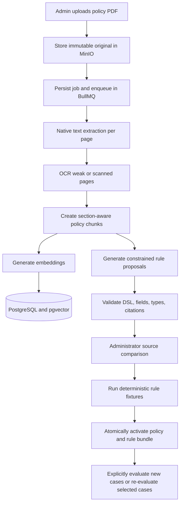
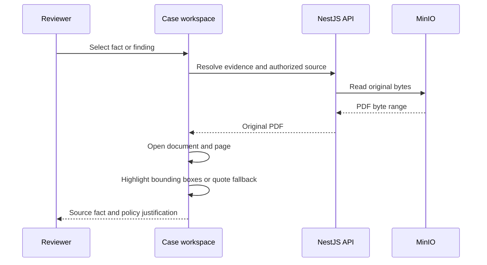

# Policy, Evidence, and Job Feedback Specification

## Outcome

CaseLens administrators can upload versioned policy documents, inspect the original source, review AI-proposed deterministic rules, test and activate approved rule bundles, and use their indexed passages during case evaluation. Reviewers inspect the actual uploaded case document and navigate from a fact or finding to its cited page and highlight. Processing feedback is durable, real time, and visible only to the user who enqueued the job, except that the platform administrator may inspect all jobs.

## Decisions

- Tenant administrators manage only their tenant's policies. The platform administrator may manage and inspect every tenant.
- The first policy source format is PDF. German, English, and mixed-language documents are supported.
- Uploaded policy versions are immutable. Drafts may be deleted; activated versions may only be superseded or revoked.
- The local demo allows self-approval with an audit warning. Production supports a configurable four-eyes approval requirement.
- Extracted rules supplement domain-pack rules. Overrides require an explicit reviewed priority; conflicts never resolve by upload time alone.
- A rule proposal referencing a field absent from the domain-pack field catalog cannot be activated.
- Existing cases retain the exact policy/rule versions used. Re-evaluation is explicit.
- Every activated rule needs positive, negative, missing-value, and boundary test cases.
- The original PDF is the primary review surface. Extracted text is a secondary reviewer view.
- PDF rendering stays local using PDF.js; source bytes are delivered through a tenant-authorized endpoint.
- Evidence navigation uses document, page, quote, source, confidence, and one or more normalized bounding boxes. Quote matching is an explicitly labelled fallback.
- Selecting evidence navigates first. Correction remains a separate action.
- Multiple evidence spans use a primary highlight and Previous/Next navigation.
- Desktop may compare case evidence and policy evidence side by side; mobile switches between them.
- Job events are durable in PostgreSQL and streamed with Server-Sent Events, with polling fallback.
- Tenant users see only jobs they enqueued. Switching to another profile must not expose another user's notifications. The platform administrator may inspect all.
- Queue claim, cancellation, and queue-record cleanup are distinct events and use distinct wording.
- Job events remain for 90 days by default. In-app notifications ship before browser notifications.

## Trust boundaries

Original document bytes remain in object storage. Extracted policy text is untrusted evidence and cannot execute code, introduce new field paths, modify prompts, or activate rules. AI output is a schema-validated proposal. Deterministic validation, test execution, and explicit human approval gate activation.

## Canonical processing timeline

## Evidence navigation

## Job visibility

`jobs.enqueued_by_user_id` and every `job_events.actor_user_id` are authoritative. Tenant users query by both tenant and enqueuing user. The platform administrator uses the aggregate scope. User-facing errors contain safe codes and guidance; provider diagnostics remain administrator-only.
