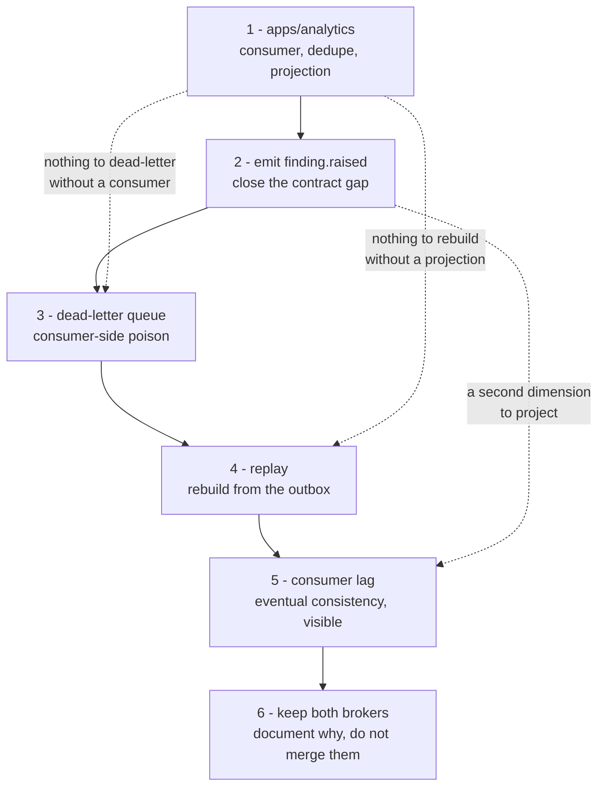

# Event Backbone and Analytics Read Model

**Goal:** Give CaseLens a real event backbone — domain facts published from an outbox, delivered over RabbitMQ — and a first independent service that consumes them into its own database as a CQRS read model.

**Why this shape:** The application already processes work asynchronously, but it is not event-driven. `apps/api` and `apps/worker` both hold direct connections to the same PostgreSQL and both write `cases`, so neither can be deployed or evolved independently. BullMQ carries _commands_ ("process this case") addressed to one known consumer, not _facts_ ("this case was decided") broadcast to whoever cares. `job_events` looks like a stream but is a progress log written and read by the same process. Nothing today can react to a business fact.

**Decisions (user, 2026-09-06):** an analytics read model first; RabbitMQ as the transport; the new service owns its own database.

## The tension these choices create, and the resolution

RabbitMQ is a broker, not a log: an acknowledged message is gone. A read model needs **replay** — drop the projection, rebuild it from history — which is what makes a projection safe to change. A broker alone cannot provide that.

So the **outbox table is the log and RabbitMQ is the delivery mechanism**. Events are appended to PostgreSQL in the same transaction as the business change they describe; a relay publishes them to RabbitMQ for live consumers; rebuilding a projection replays from the table. This is the pattern the system would want anyway, and it makes the difference between a broker and a log concrete rather than theoretical.

## Concepts this is built to demonstrate

| Concept                | Where it shows up                                                                                     |
| ---------------------- | ----------------------------------------------------------------------------------------------------- |
| Command versus event   | BullMQ keeps carrying commands; the new exchange carries facts                                        |
| Dual-write problem     | Writing business state and publishing separately can lose events; the outbox removes the second write |
| Transactional outbox   | The event row and the business row commit or roll back together                                       |
| At-least-once delivery | The relay may publish a row twice; that is expected, not a bug                                        |
| Idempotent consumer    | The projector dedupes on event id, so redelivery is harmless                                          |
| Topic routing          | `caselens.events` topic exchange, routing key = event type, bindings choose                           |
| Dead lettering         | A poison message goes to a DLX rather than blocking the queue                                         |
| Eventual consistency   | The read model lags the write model, visibly                                                          |
| CQRS                   | Analytics answers questions the transactional schema is a poor shape for                              |
| Replay                 | Projections rebuild from the event log without touching the source services                           |

## Architecture

```
apps/api ──(same tx)──> domain_events (outbox, append-only, in the main database)
                              │
                        relay (claims unpublished, in sequence)
                              │  publish
                              v
                  RabbitMQ topic exchange  caselens.events
                     routing key = event type, e.g. case.decided
                              │  binding
                              v
                  queue analytics.events ──> apps/analytics ──> its OWN database
                              │ (on repeated failure)
                              v
                  analytics.events.dlq
```

## Event contract

A new workspace package `packages/events` holds the envelope and payload schemas, shared by publisher and consumer so the wire format has one definition. Every event carries:

- `id` — unique; the consumer's idempotency key
- `type` — e.g. `case.decided`; also the routing key
- `tenantId` — every fact belongs to a tenant
- `aggregateType` / `aggregateId` — what it happened to
- `occurredAt` — when it happened, not when it was delivered
- `sequence` — monotonic per the outbox, so a replay is ordered
- `payload` — typed per event

First three events, chosen because they are what a throughput read model needs: `case.created`, `case.decided`, `finding.raised`.

## Phases

**Phase 1 — the outbox. Done.** `domain_events` is written from `apps/api` inside the transaction that makes the business change. An integration test proves a rolled-back change leaves no event.

**Phase 2 — transport and the read model. Half done.** The relay drains the outbox to the `caselens.events` topic exchange on a confirm channel, claims its batch under `FOR UPDATE SKIP LOCKED` so several relays partition the backlog, and quarantines a row it can never publish instead of letting it starve the batch. `apps/analytics` now exists and consumes: a durable queue, explicit bindings per event type, ack-after-processing, and a dead-letter queue for what it cannot process. It has no projection yet, so it logs what arrives. Everything below step 1a remains to be built.

**Phase 3 — the hard parts. Done.** Replay, a dead-letter queue with a poison-message test, and visible consumer lag.

**Phase 4 — dropped (user, 2026-09-06).** The original plan was to move `process_case` and
`process_policy` onto RabbitMQ and delete Redis. The user reversed that: the two brokers coexist,
because they are not carrying the same kind of message. BullMQ carries commands to one known
consumer; RabbitMQ carries facts to whoever binds. Collapsing them would mean rebuilding delayed
redelivery, the attempt ceiling, per-job locks and stall detection by hand — RabbitMQ has no native
delayed redelivery, so that means a TTL retry queue dead-lettering back to the work queue — for the
sole prize of removing one container.

This is recorded rather than deleted because the reasoning is the interesting part: two brokers is
not automatically duplication when each is doing a job the other is bad at.

## Next steps, in order

Each step is shippable on its own and teaches one thing. The ordering is not arbitrary — a later step is hard to demonstrate without the one before it.



### 1a. `apps/analytics` — the first consumer. Done.

The point of the whole exercise: a service that learns everything from events, owns its own database, and could be deleted without the case pipeline noticing.

- ~~New workspace app modelled on `apps/worker`~~ — done. Plain Node ESM, no NestJS: the point of the service is that a second service can be built against nothing but the event contract, and a framework shared with `apps/api` would quietly make it look like another arm of the same application. It reuses `infra/docker/node.Dockerfile`, which is already parameterised by `PACKAGE`.
- ~~Assert a **durable queue** bound to the exchange~~ — done, with one binding per handled event type rather than `case.*`, which would have excluded `finding.raised`. The dead-letter exchange is declared now because queue arguments are immutable and adding one later means deleting the queue.
- ~~Manual ack with a bounded `prefetch`~~ — done, so a slow projection applies backpressure instead of buffering the backlog in memory.
- Its own migrations, separate from `packages/persistence`. Two shapes: `processed_events(event_id PK, sequence, processed_at)` and the projection tables.
- **Dedupe and project in one transaction.** Delivery is at-least-once, so the consumer will see the same event twice. Recording the id and updating the projection in separate transactions recreates the dual-write problem on the consumer side — the same bug the outbox removed on the publisher side, which is worth running into rather than being told about.
- Answer the question this plan set: cases decided per tenant per day, and median time from creation to decision. `case.decided` already carries `caseCreatedAt` precisely so this needs no lookup back into the case service.
- A small read API over the projection.

### 2. Emit `finding.raised`. Done.

`packages/events` declares this type and nothing publishes it — the contract advertises an event that does not exist. Findings are written by the worker through `store.saveWithJobUpdate(...)`, which does not accept events yet, so this means threading an `events` parameter through it the way `save()` was extended. Analytics then gains a second dimension: severity mix per tenant.

The alternative, if it turns out not to be worth emitting: delete the type. An advertised event that is never published is worse than one that was never declared.

### 3. Dead-letter queue. Done.

Distinct from the quarantine already built. That one is **publisher-side** — a row the relay can never parse. This one is **consumer-side** — a message analytics cannot process, which without a DLQ either blocks the queue on endless redelivery or vanishes on reject.

- `analytics.events` declared with `x-dead-letter-exchange` pointing at `caselens.events.dlx`, and `analytics.events.dlq` bound to it.
- Reject with `requeue=false` once a delivery has failed enough times, rather than requeuing forever.
- A test that publishes a deliberately unprocessable message and asserts it lands in the DLQ while the next good message is still processed.

### 4. Replay. Done.

The payoff of deciding that the outbox is the log. Drop the projection, rebuild it from `domain_events` in sequence order, and the read model becomes safe to change.

There is a real tension to resolve deliberately rather than by accident: the constraints below say **no consumer reads another service's tables**, and a naive replay has analytics selecting straight from the main database. The options:

- **(a)** Analytics reads `domain_events` directly, for replay only. Simplest, and quietly breaks the invariant that makes the service independent.
- **(b)** A replay publisher on the worker side re-reads the outbox and republishes to a replay-scoped queue; analytics consumes it exactly as it consumes live traffic.
- **(c)** An admin endpoint on `apps/api` that streams history.

**(b) was built.** A `replay.started` control message opens the stream on a replay-specific exchange, analytics clears its projections and `processed_events` in one transaction on seeing it, and the history that follows runs through exactly the consumer code live traffic runs through. The consumer stayed a consumer.

### 5. Make consumer lag visible. Done.

Eventual consistency is the thing everyone accepts in the abstract and is surprised by in practice. Surface `max(sequence)` in the outbox minus the highest sequence analytics has projected — as a number in the read API, and in the console if it is cheap. Then demonstrate it deliberately: pause the consumer, decide a case, watch the number climb and the read model disagree with the write model until it catches up.

### 6. Keep both brokers, and write down why

Settled, so this is documentation rather than work: Redis/BullMQ keeps the command path, RabbitMQ
keeps the fact path. The thing worth capturing is what BullMQ actually provides on top of Redis —
the atomic claim, the per-job lock with a duration, stall recovery, attempt counting, exponential
backoff, deduplication by job id — because none of that is a Redis feature and all of it would have
to be rebuilt to remove it.

## Constraints

- The existing BullMQ path is untouched. Commands stay commands; this adds a parallel fact channel rather than replacing the work queue.
- No consumer reads another service's tables. Analytics owns its database and learns everything from events.
- Events are facts in the past tense, named for what happened, never instructions.
- An event payload carries what a consumer needs, not a database row. Leaking the internal shape recreates the coupling this removes.
- Publishing is at-least-once and consumers must be idempotent. Exactly-once is not offered and should not be assumed.
